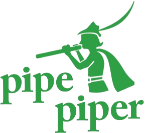

<div align="center">
  <div>
    
    <h4 align="center">Follow the bird <a href="https://twitter.com/_sukharev_"></a>
  </div>
	<h1>Pipe Piper is a dead simple functional pipeline for typescript.</h1>
	<a href="https://www.npmjs.com/package/pipepiper"></a>
</div>

Ever felt overwhelmed with writing a business logic pipeline in OOP or procedural style? this is probably because your functions are scattered all over the place and it's complicated to track and run your code in brains.

it usually looks like this:

```js
class Vehicle {
  /* some code */
}

class Car extends Vehicle {
  /* code to make Vehicle drive */
}

class Airplane extends Vehicle {
  /* code to make Vehicle fly */
}

// and then you do something like this

class Traveler {
  travel(vehicle: Vehicle) {
    const destination = await vehicle.use(); // takes time
    this.destination = destination;
  }
}

class AdventureController {
  start(traveler: Traveler) {
    const car = new Car();
    traveler.travel(car);

    const airplane = new Airplane();
    traveler.travel(airplane);
  }
}
```

although the beautiful masterpiece of OOP above is simple, it's still overwhelming, right?

now imagine this classes and methods live in different files, they may also call different services and other classes and functions, you know how it always ends—CONFUSING!

i dont like OOP, bc it's too complicated to trace where and what is happening, so i invented functional programming again.

meet Pipe Piper — pipe data through a sequence of strictly typed functions. make all of your business logic visible at once.

use it like this:

```ts
interface PipelineParams {
    travelerId: number;
    traveler: Traveler;
    destination: Destination;
}

function getTraveler(params: PipelineParams) {
    const traveler = getTraveler(params.travelerId);

    return {...params, traveler};
}

function getDestination(params: PipelineParams) {
    const destination = getDestination(params.traveler.destinationId);

    return {...params, destination};
}

function driveCar(params: PipelineParams) {
    // etc
}

export const travel = pipe(
  getTraveler,
  getDestination,
  driveCarToAirport,
  fork(buyWater, buyFood, sleep)
  flyPlane,
);

travel({travelerId: 1, destination: "San Francisco"})

```
